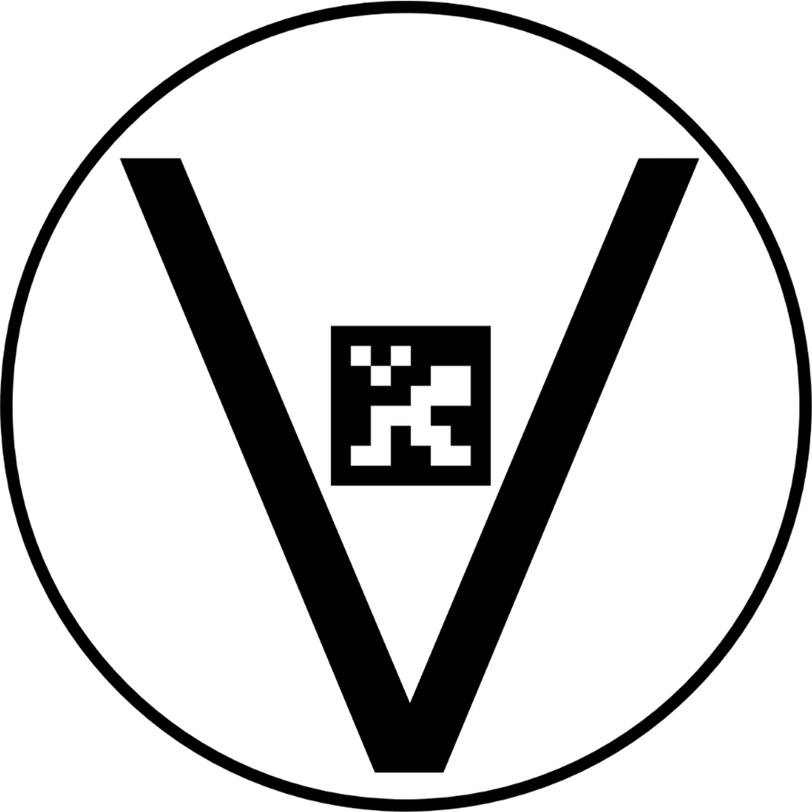

# Precision Landing

드론 정밀착륙 ROS2 패키지. 바닥의 V-마커를 인식하여 35m 상공에서 자율 정밀착륙을 수행한다.

## 동작 원리

| 고도     | 검출 방식                      | 동작                        |
| -------- | ------------------------------ | --------------------------- |
| 35m ~ 8m | 원형 테두리 (HoughCircles)     | V-마커 위치 파악 및 XY 정렬 |
| 8m ~ 2m  | ArUco 마커 (DICT_4X4_50, ID 0) | 정밀 XY 정렬 및 하강        |
| 2m ~ 0m  | 없음 (맹목 하강)               | PX4 착륙 감지까지 수직 하강 |

## 마커 규격



- 외곽 크기: **3m × 3m** (원형 테두리 포함)
- 내장 ArUco: **DICT_4X4_50, ID 0, 50cm × 50cm**
- 텍스처 생성: `python3 scripts/generate_marker_texture.py`

## 패키지 구성

```
src/
├── pl_msgs/      커스텀 메시지 (MarkerDetection, LandingState)
├── pl_nodes/     검출 노드 + FSM 제어 노드
└── pl_bringup/   Launch 파일 (SITL / 실제 하드웨어)
```

## 문서

- [소프트웨어 아키텍처](docs/architecture.md) — 노드 구성, FSM, 비전 파이프라인, 좌표 변환, PID 수식
- [실행 매뉴얼](docs/run_manual.md) — 상세 실행 절차, 파라미터 튜닝, 트러블슈팅
