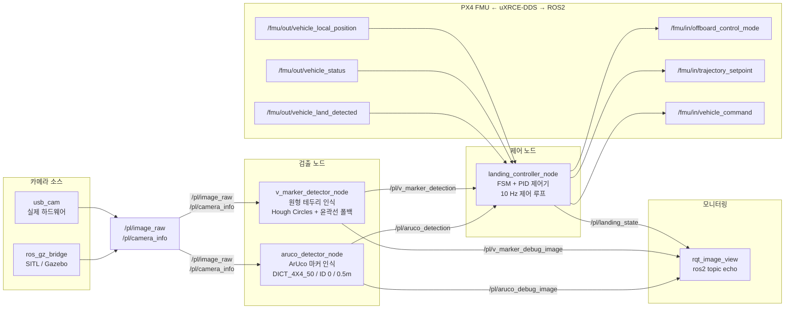
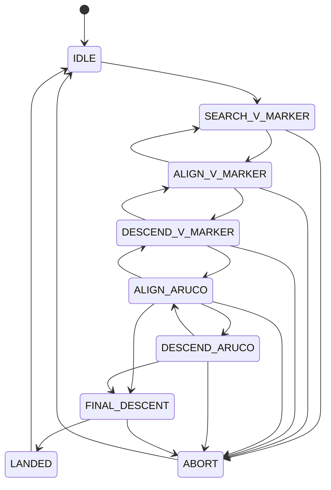
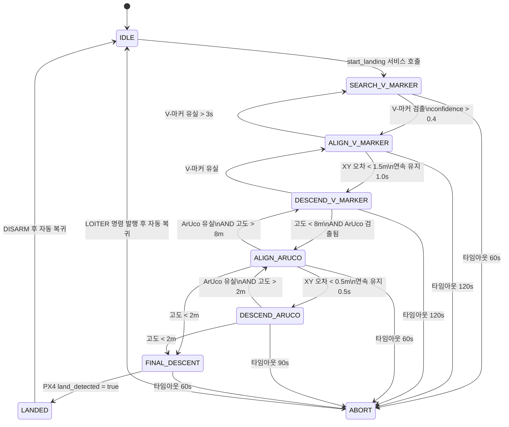

# 정밀착륙 소프트웨어 아키텍처

## 목차

1. [시스템 개요](#1-시스템-개요)
2. [패키지 구조](#2-패키지-구조)
3. [노드 구성 및 통신 아키텍처](#3-노드-구성-및-통신-아키텍처)
4. [토픽 및 메시지 명세](#4-토픽-및-메시지-명세)
5. [유한 상태 기계 (FSM)](#5-유한-상태-기계-fsm)
6. [비전 파이프라인](#6-비전-파이프라인)
7. [좌표 변환 체계](#7-좌표-변환-체계)
8. [PID 제어기](#8-pid-제어기)
9. [시뮬레이션 환경](#9-시뮬레이션-환경)
10. [설계 제약 및 고려사항](#10-설계-제약-및-고려사항)

## 1. 시스템 개요

### 1.1 목적

본 시스템은 드론이 35m 상공에서 V-마커를 자동으로 인식하고, 마커 정중앙에 정밀착륙하는 자율 비행 기능을 제공한다. 카메라 기반 두 단계 검출(원형 테두리 → ArUco)과 FSM(Finite State Machine) 기반 제어 로직으로 구성된다.

### 1.2 운영 시나리오

| 단계          | 고도 범위 | 사용 검출기          | 설명                                |
| ------------- | --------- | -------------------- | ----------------------------------- |
| 탐색          | 35m       | V-마커 (원형 테두리) | 초기 마커 위치 파악                 |
| 정렬 (coarse) | 35m ~ 8m  | V-마커 (원형 테두리) | XY 오차 1.5m 이내로 수렴            |
| 정렬 (fine)   | 8m ~ 2m   | ArUco                | XY 오차 0.5m 이내로 수렴            |
| 최종 하강     | 2m ~ 0m   | 없음 (맹목 하강)     | ArUco 가시 범위 이탈, PX4 착륙 감지 |

### 1.3 사용 기술

| 구분       | 기술                             |
| ---------- | -------------------------------- |
| 미들웨어   | ROS2 Humble                      |
| 언어       | Python 3.10+                     |
| 비전       | OpenCV 4.x (HoughCircles, ArUco) |
| 비행 제어  | PX4 v1.14 (uXRCE-DDS 통신)       |
| 시뮬레이션 | Gazebo Harmonic 8.x              |

## 2. 패키지 구조

```
precision-landing/
├── src/
│   ├── pl_msgs/                          # CMake: 커스텀 ROS2 메시지 정의
│   │   └── msg/
│   │       ├── MarkerDetection.msg
│   │       └── LandingState.msg
│   ├── pl_nodes/                         # Python: 검출 및 제어 노드
│   │   ├── pl_nodes/
│   │   │   ├── v_marker_detector_node.py
│   │   │   ├── aruco_detector_node.py
│   │   │   └── landing_controller_node.py
│   │   └── config/
│   │       ├── v_marker_detector_params.yaml
│   │       ├── aruco_detector_params.yaml
│   │       └── landing_controller_params.yaml
│   └── pl_bringup/                       # Python: Launch 파일
│       └── launch/
│           ├── precision_landing_sitl.launch.py
│           └── precision_landing_real.launch.py
├── simulation/
│   ├── worlds/precision_landing.sdf      # Gazebo 월드
│   └── models/v_marker/                  # V-마커 3D 모델
├── scripts/
│   └── generate_marker_texture.py        # V-마커 텍스처 생성
└── docs/
    ├── architecture.md                   # 본 문서
    └── run_manual.md                     # 실행 매뉴얼
```

## 3. 노드 구성 및 통신 아키텍처

### 3.1 전체 노드 그래프



### 3.2 노드 역할 요약

| 노드                      | 실행 파일              | 주요 역할                                                     |
| ------------------------- | ---------------------- | ------------------------------------------------------------- |
| `v_marker_detector_node`  | `v_marker_detector`    | 원형 테두리 검출, 거리 추정, `/pl/v_marker_detection` 발행    |
| `aruco_detector_node`     | `aruco_detector`       | ArUco 검출, solvePnP 3D 포즈 추정, `/pl/aruco_detection` 발행 |
| `landing_controller_node` | `landing_controller`   | FSM 관리, PID 속도 제어, PX4 명령 발행                        |
| `usb_cam_node_exe` (외부) | `usb_cam` 패키지       | USB 카메라 → `/pl/image_raw`                                  |
| `parameter_bridge` (외부) | `ros_gz_bridge` 패키지 | Gazebo 카메라 → `/pl/image_raw`                               |

## 4. 토픽 및 메시지 명세

### 4.1 토픽 목록

| 토픽                              | 메시지 타입                     | 방향 | QoS                   | 발행자              | 구독자             |
| --------------------------------- | ------------------------------- | ---- | --------------------- | ------------------- | ------------------ |
| `/pl/image_raw`                   | `sensor_msgs/Image`             | →    | BEST_EFFORT / depth 1 | usb_cam / gz_bridge | v_marker, aruco    |
| `/pl/camera_info`                 | `sensor_msgs/CameraInfo`        | →    | BEST_EFFORT / depth 1 | usb_cam / gz_bridge | v_marker, aruco    |
| `/pl/v_marker_detection`          | `pl_msgs/MarkerDetection`       | →    | RELIABLE / depth 10   | v_marker_detector   | landing_controller |
| `/pl/aruco_detection`             | `pl_msgs/MarkerDetection`       | →    | RELIABLE / depth 10   | aruco_detector      | landing_controller |
| `/pl/landing_state`               | `pl_msgs/LandingState`          | →    | RELIABLE / depth 10   | landing_controller  | 모니터링           |
| `/pl/v_marker_debug_image`        | `sensor_msgs/Image`             | →    | BEST_EFFORT / depth 1 | v_marker_detector   | 모니터링           |
| `/pl/aruco_debug_image`           | `sensor_msgs/Image`             | →    | BEST_EFFORT / depth 1 | aruco_detector      | 모니터링           |
| `/fmu/out/vehicle_local_position` | `px4_msgs/VehicleLocalPosition` | →    | BEST_EFFORT / depth 1 | PX4                 | landing_controller |
| `/fmu/out/vehicle_status`         | `px4_msgs/VehicleStatus`        | →    | BEST_EFFORT / depth 1 | PX4                 | landing_controller |
| `/fmu/out/vehicle_land_detected`  | `px4_msgs/VehicleLandDetected`  | →    | BEST_EFFORT / depth 1 | PX4                 | landing_controller |
| `/fmu/in/offboard_control_mode`   | `px4_msgs/OffboardControlMode`  | ←    | BEST_EFFORT / depth 1 | landing_controller  | PX4                |
| `/fmu/in/trajectory_setpoint`     | `px4_msgs/TrajectorySetpoint`   | ←    | BEST_EFFORT / depth 1 | landing_controller  | PX4                |
| `/fmu/in/vehicle_command`         | `px4_msgs/VehicleCommand`       | ←    | BEST_EFFORT / depth 1 | landing_controller  | PX4                |

### 4.2 커스텀 메시지 정의

#### `pl_msgs/msg/MarkerDetection.msg`

```
std_msgs/Header header           # 타임스탬프 및 프레임 ID
bool detected                    # 현재 프레임에서 마커 검출 여부
string detector_type             # "v_marker" | "aruco"
float32 image_x                  # 검출 중심 픽셀 좌표 u (px)
float32 image_y                  # 검출 중심 픽셀 좌표 v (px)
float32 image_width              # 바운딩 폭 (원: 직경) (px)
float32 image_height             # 바운딩 높이 (px)
float32 confidence               # 검출 신뢰도 [0.0, 1.0]
geometry_msgs/PoseStamped pose   # 카메라 프레임 기준 3D 포즈 (ArUco 전용)
float32 estimated_distance       # 추정 거리 (m)
```

#### `pl_msgs/msg/LandingState.msg`

```
std_msgs/Header header           # 타임스탬프
string state                     # 현재 FSM 상태 이름
string previous_state            # 직전 FSM 상태 이름
float32 altitude_agl             # 현재 고도 (m, AGL 기준)
bool v_marker_visible            # V-마커 검출 유효 여부
bool aruco_visible               # ArUco 검출 유효 여부
float32 error_x                  # NED X축 오차 (m, 양수 = 북쪽으로 벗어남)
float32 error_y                  # NED Y축 오차 (m, 양수 = 동쪽으로 벗어남)
float32 time_in_state            # 현재 상태 체류 시간 (s)
string fallback_reason           # ABORT 전환 원인 (ABORT 상태일 때만 유효)
```

## 5. 유한 상태 기계 (FSM)

### 5.1 FSM 상태 개요



### 5.2 FSM 전이 다이어그램 (전이 조건 포함)



### 5.3 FSM 상태 명세

| 상태                 | 제어 동작                              | 입력 조건                 | 폴백 조건                                     |
| -------------------- | -------------------------------------- | ------------------------- | --------------------------------------------- |
| **IDLE**             | 현재 위치 유지 (속도 0)                | —                         | —                                             |
| **SEARCH_V_MARKER**  | 현재 위치 홀드, OFFBOARD 하트비트 발행 | V-마커 confidence > 0.4   | 60s → ABORT                                   |
| **ALIGN_V_MARKER**   | XY PID (coarse), 고도 유지             | XY 오차 < 1.5m, 1.0s 유지 | 유실 3s → SEARCH, 120s → ABORT                |
| **DESCEND_V_MARKER** | XY PID (coarse) + 하강 0.5 m/s         | 고도 < 8m AND ArUco 검출  | 유실 → ALIGN_V, 120s → ABORT                  |
| **ALIGN_ARUCO**      | XY PID (fine), 고도 유지               | XY 오차 < 0.5m, 0.5s 유지 | 유실/고도 → DESCEND_V 또는 FINAL, 60s → ABORT |
| **DESCEND_ARUCO**    | XY PID (fine) + 하강 0.4 m/s           | 고도 < 2m                 | 유실 → ALIGN_ARUCO, 90s → ABORT               |
| **FINAL_DESCENT**    | vx=vy=0, 하강 0.3 m/s (맹목)           | land_detected = true      | 60s → ABORT                                   |
| **LANDED**           | DISARM 명령 → IDLE                     | —                         | —                                             |
| **ABORT**            | LOITER 모드 명령 → IDLE                | —                         | —                                             |

### 5.4 폴백(Fallback) 설계 원칙

- **신호 유실** 시: 마지막으로 신뢰할 수 있는 상태(상위 검출기)로 복귀한다.
- **타임아웃** 발생 시: 즉시 ABORT로 전환하고, LOITER 명령으로 드론을 안정 상태로 전환한다.
- **고도 근접** 시 (`< 2m`): ArUco 인식 불가 여부와 무관하게 FINAL_DESCENT로 전환하며, 이는 정상 경로이다. 마커 유실로 처리하지 않는다.
- **PID 리셋**: 모든 상태 전환 시 PID 적분기와 미분 항을 초기화하여 전환 충격(bump)을 방지한다.

## 6. 비전 파이프라인

### 6.1 V-마커 검출 (원형 테두리)

```
입력 이미지 (BGR)
    │
    ▼
그레이스케일 변환 (cv2.cvtColor)
    │
    ▼
가우시안 블러 (커널 9×9, σ=2)
  → 고주파 노이즈 제거, Canny 엣지 안정화
    │
    ▼
HoughCircles
  dp=1.2, minDist=H/4, param1=50, param2=30
  minRadius=H×0.02, maxRadius=H×0.60
    │
    ├── 검출 성공: 이미지 중심에 가장 가까운 원 선택
    │   confidence = 1 - (center_dist / max_dist)
    │
    └── 검출 실패: 윤곽선 폴백
        이진화(threshold=200) → 최대 윤곽선 → minEnclosingCircle
        confidence ≤ 0.6 (폴백 패널티)
    │
    ▼
거리 추정 (핀홀 모델, 아래 수식 참고)
  D_real = 3.0m (원형 테두리 실제 직경)
    │
    ▼
MarkerDetection 발행
```

$$d = \frac{f_x \cdot D_\text{real}}{d_\text{px}}$$

**HoughCircles 파라미터 해설**

| 파라미터  | 역할                                 | 조정 지침                             |
| --------- | ------------------------------------ | ------------------------------------- |
| `dp`      | 누산기 해상도 비율 (1 = 원본 해상도) | 1.0~2.0; 높을수록 속도↑ 정밀도↓       |
| `param1`  | Canny 엣지 상위 임계값               | 낮추면 엣지 민감도↑, 오탐↑            |
| `param2`  | 누산기 임계값                        | **낮출수록 더 많이 검출** (오탐 주의) |
| `minDist` | 원 중심 간 최소 거리                 | H/4 → 화면 내 1개만 탐지 유도         |

### 6.2 ArUco 마커 검출

#### 6.2.1 카메라 캘리브레이션 모델

카메라는 핀홀(Pinhole) 모델로 표현되며, 내부 파라미터 행렬 $\mathbf{K}$와 왜곡 계수 벡터 $\mathbf{D}$로 특성화된다.

$$\mathbf{K} = \begin{bmatrix} f_x & 0 & c_x \\ 0 & f_y & c_y \\ 0 & 0 & 1 \end{bmatrix}, \qquad \mathbf{D} = [k_1,\ k_2,\ p_1,\ p_2,\ k_3]$$

| 파라미터         | 의미                                         |
| ---------------- | -------------------------------------------- |
| `fx`, `fy`       | x, y 축 초점 거리 (픽셀 단위)                |
| `cx`, `cy`       | 주점(principal point), 보통 이미지 중심 근방 |
| `k1`, `k2`, `k3` | 방사 왜곡(radial distortion) 계수            |
| `p1`, `p2`       | 접선 왜곡(tangential distortion) 계수        |

**방사 왜곡**은 렌즈 광축으로부터의 거리에 따라 이미지가 안쪽(barrel) 또는 바깥쪽(pincushion)으로 왜곡되는 현상이다. 왜곡 보정 공식 ($r^2 = x^2 + y^2$):

$$x' = x\,(1 + k_1 r^2 + k_2 r^4 + k_3 r^6) + 2p_1 xy + p_2(r^2 + 2x^2)$$

$$y' = y\,(1 + k_1 r^2 + k_2 r^4 + k_3 r^6) + p_1(r^2 + 2y^2) + 2p_2 xy$$

`cv2.solvePnP`는 내부적으로 왜곡 보정을 수행하므로, **K**와 **D**를 정확하게 제공해야 3D 포즈 추정 오차가 최소화된다.

#### 6.2.2 검출 흐름

```
입력 이미지 (BGR)
    │
    ▼
그레이스케일 변환
    │
    ▼
ArucoDetector.detectMarkers()
  사전: DICT_4X4_50 (ID 범위: 0~49)
  대상 ID: 0 (마커 크기: 0.5m × 0.5m)
    │
    ▼
코너 4점 검출 (image coordinates)
    │
    ▼
cv2.solvePnP
  입력:
    - 물체 좌표계 코너 3D 좌표
      [(-0.25, +0.25, 0), (+0.25, +0.25, 0),
       (+0.25, -0.25, 0), (-0.25, -0.25, 0)]
    - 검출된 이미지 코너 2D 픽셀 좌표
    - 카메라 행렬 K
    - 왜곡 계수 D
  출력:
    - rvec: 회전 벡터 (Rodrigues)
    - tvec: 변환 벡터 = 카메라 프레임 기준 마커 중심 좌표 (m)
    │
    ▼
tvec → NED 오차 변환 (7장 참고)
    │
    ▼
MarkerDetection 발행 (pose 필드 포함)
```

#### 6.2.3 solvePnP 원리

PnP (Perspective-n-Point) 문제는 3D 점들의 알려진 좌표와 해당 2D 투영 좌표가 주어졌을 때 카메라의 포즈를 구하는 문제다.

$$s \begin{bmatrix} u \\ v \\ 1 \end{bmatrix} = \mathbf{K} \begin{bmatrix} \mathbf{R} \mid \mathbf{t} \end{bmatrix} \begin{bmatrix} X \\ Y \\ Z \\ 1 \end{bmatrix}$$

- $[X, Y, Z]^\top$: 마커 물체 좌표계의 3D 점
- $[u, v]^\top$: 이미지 픽셀 좌표
- $\mathbf{R}$: 3×3 회전 행렬
- $\mathbf{t}$: 3×1 변환 벡터 (= 카메라에서 마커까지의 벡터)
- $s$: 스케일 팩터

$\mathbf{t} = [t_x, t_y, t_z]^\top$ 에서 $t_z$는 카메라 광축 방향 거리(깊이)이며, 이것이 `estimated_distance`로 사용된다.

## 7. 좌표 변환 체계

### 7.1 좌표계 정의

본 시스템에서 사용하는 좌표계는 다음과 같다.

| 좌표계                 | 기호  | 설명                 | 축 방향                       |
| ---------------------- | ----- | -------------------- | ----------------------------- |
| **카메라 광학 좌표계** | C_opt | 이미지 좌표계와 정렬 | X: 오른쪽, Y: 아래쪽, Z: 앞쪽 |
| **드론 바디 프레임**   | B     | 드론 본체 기준       | X: 앞쪽, Y: 오른쪽, Z: 아래쪽 |
| **NED 프레임**         | W     | 월드 프레임          | X: 북쪽, Y: 동쪽, Z: 아래쪽   |

### 7.2 카메라 장착 구성

`x500_mono_cam_down` 모델에서 카메라는 드론 기준 10cm 하방에 90° 피치 회전으로 장착되어 있다 (하방 촬영).

```
SDF joint pose: 0 0 0.10 0 1.5707 0
               (x y z roll pitch yaw)
```

이로 인해 카메라 광학 Z축(전방)이 지면을 향하게 된다.

### 7.3 광학 좌표계 → NED 변환 행렬

하방 카메라에서 검출된 오프셋을 드론 제어에 사용하려면 광학 좌표계에서 NED 좌표계로 변환해야 한다.

**유도 과정**:

| 광학 좌표계 축 | 방향   | NED 대응 축           | 관계                           |
| -------------- | ------ | --------------------- | ------------------------------ |
| $X_\text{opt}$ | 오른쪽 | $Y_\text{NED}$ (동쪽) | $Y_\text{NED} = +X_\text{opt}$ |
| $Y_\text{opt}$ | 아래쪽 | $X_\text{NED}$ (북쪽) | $X_\text{NED} = -Y_\text{opt}$ |
| $Z_\text{opt}$ | 앞쪽   | $Z_\text{NED}$ (아래) | $Z_\text{NED} = +Z_\text{opt}$ |

따라서 변환 행렬:

$$\mathbf{R}_\text{OPT→NED} = \begin{bmatrix} 0 & -1 & 0 \\ 1 & 0 & 0 \\ 0 & 0 & 1 \end{bmatrix}, \qquad \begin{bmatrix} X_\text{NED} \\ Y_\text{NED} \\ Z_\text{NED} \end{bmatrix} = \mathbf{R}_\text{OPT→NED} \begin{bmatrix} X_\text{opt} \\ Y_\text{opt} \\ Z_\text{opt} \end{bmatrix}$$

### 7.4 ArUco tvec → NED 오차 변환

```python
# tvec: solvePnP 출력, 카메라 광학 프레임 기준 마커 위치
tag_pos_cam = [tvec[0], tvec[1], tvec[2]]

# 광학 → NED 변환
tag_pos_ned = R_OPT_NED @ tag_pos_cam

# 카메라 오프셋 보정 (드론 바디 기준 카메라 위치: 10cm 하방)
camera_offset = [0.0, 0.0, -0.1]  # NED 기준: z 음수 = 위쪽
tag_pos_body = tag_pos_ned + camera_offset

# NED 오차 (= 마커 위치 - 드론 위치)
# solvePnP tvec의 부호 규약:
#   tvec > 0: 마커가 카메라 오른쪽/아래쪽/앞쪽에 있음
# 따라서 이 값을 그대로 오차로 사용 (목표: tvec → 0)
err_x = tag_pos_body[0]  # NED-X 오차 (m)
err_y = tag_pos_body[1]  # NED-Y 오차 (m)
```

### 7.5 V-마커 픽셀 오프셋 → NED 오차 변환

V-마커 검출은 3D 포즈가 없고 픽셀 오프셋과 추정 거리만 제공하므로, 핀홀 모델 역투영을 이용한다.

```python
# 픽셀 좌표 → 카메라 좌표 (정규화)
dx_cam = (image_x - cx) / fx * estimated_distance
dy_cam = (image_y - cy) / fy * estimated_distance

# 광학 → NED 변환
err_ned = R_OPT_NED @ [dx_cam, dy_cam, 0.0]
err_x = err_ned[0]
err_y = err_ned[1]
```

> **주의**: V-마커 단계에서 $f_x$는 CameraInfo가 없는 경우 수동 FOV 기반으로 근사한다.
> $$f_x \approx \frac{W}{2\,\tan({\theta_H}/{2})}$$
> mono_cam 기준 $W = 1280\,\text{px}$, $\theta_H = 1.74\,\text{rad}$ → $f_x \approx 740\,\text{px}$

## 8. PID 제어기

### 8.1 개요

착륙 컨트롤러는 XY 축 각각에 독립적인 PID 제어기를 사용하여 드론의 수평 오차를 속도 명령으로 변환한다. PX4에 속도 setpoint를 전달하면, PX4 내부 속도 루프가 실제 추력으로 변환한다.

```
오차 (e) ──► PID 제어기 ──► 속도 명령 (v_cmd) ──► PX4 TrajectorySetpoint
              │                                         │
              └──── 피드백: VehicleLocalPosition ◄──────┘
```

### 8.2 PID 제어기 수식

이산 시간 PID 제어기 (샘플링 주기 $\Delta t = 0.1$ s):

**비례 항 (P)**

$$u_P(t) = K_p \cdot e(t)$$

**적분 항 (I)** — 와인드업 방지를 위해 클램핑 적용

$$I(t) = \mathrm{clamp}\bigl(I(t-1) + e(t) \cdot \Delta t,\ -u_{\max},\ +u_{\max}\bigr)$$

$$u_I(t) = K_i \cdot I(t)$$

**미분 항 (D)**

$$u_D(t) = K_d \cdot \frac{e(t) - e(t-1)}{\Delta t}$$

**최종 출력** (클램핑 적용)

$$u(t) = \mathrm{clamp}(u_P + u_I + u_D,\ -u_{\max},\ +u_{\max})$$

**오차 정의**

$$e(t) = p_{\text{marker}} - p_{\text{drone}} \qquad [\mathrm{m},\ \text{NED 프레임}]$$

오차가 양수이면 마커가 드론보다 북쪽(또는 동쪽)에 있으며, 제어기는 해당 방향으로 양의 속도를 출력한다.

### 8.3 제어 단계별 파라미터

| 단계             | 축   | Kp  | Ki   | Kd   | max_output | 비고                       |
| ---------------- | ---- | --- | ---- | ---- | ---------- | -------------------------- |
| ALIGN_V_MARKER   | X, Y | 0.8 | 0.05 | 0.10 | 3.0 m/s    | 광역 탐색, 오차 클 수 있음 |
| DESCEND_V_MARKER | X, Y | 0.8 | 0.05 | 0.10 | 3.0 m/s    | 하강 중 보상               |
| ALIGN_ARUCO      | X, Y | 1.5 | 0.00 | 0.15 | 1.5 m/s    | 정밀 정렬, 응답성↑         |
| DESCEND_ARUCO    | X, Y | 1.5 | 0.00 | 0.15 | 1.5 m/s    | 정밀 하강                  |
| FINAL_DESCENT    | X, Y | 0.0 | 0.00 | 0.00 | 0.0 m/s    | XY 속도 0 (맹목)           |

**수직(Z축) 속도 명령** (PID 없음, 상수 사용):

| 상태             | vz (m/s, NED 기준 양수=하강) | 비고      |
| ---------------- | ---------------------------- | --------- |
| DESCEND_V_MARKER | 0.5                          | 초기 하강 |
| DESCEND_ARUCO    | 0.4                          | 정밀 하강 |
| FINAL_DESCENT    | 0.3                          | 맹목 하강 |

### 8.4 PID 리셋 정책

FSM 상태가 전환될 때마다 모든 PID 인스턴스의 적분 항(`I`)과 직전 오차(`e_prev`)를 0으로 초기화한다. 이는 이전 상태에서 누적된 적분값이 새로운 상태에서 충격(bump)을 유발하는 것을 방지한다.

### 8.5 OFFBOARD 제어 모드 (PX4)

PX4가 외부 속도 명령을 수용하려면 다음 두 가지가 충족되어야 한다.

1. **`OffboardControlMode`** 메시지를 **10Hz 이상**으로 지속 발행 (하트비트 역할)
2. **`TrajectorySetpoint`** 의 `velocity` 필드 설정, `position` 필드는 `NaN` 으로 설정

```python
# 하트비트 (매 제어 루프, 10Hz)
offboard_msg.velocity = True
offboard_msg.position = False

# 속도 setpoint
setpoint.velocity = [vx, vy, vz]      # NED 프레임 (m/s)
setpoint.position = [nan, nan, nan]    # 사용 안 함
```

PX4는 OFFBOARD 하트비트가 0.5초 이상 중단되면 HOLD 모드로 자동 복귀한다.

## 9. 시뮬레이션 환경

### 9.1 Gazebo 월드 구성

| 항목            | 설정값                       |
| --------------- | ---------------------------- |
| 물리 엔진       | ODE                          |
| 시뮬레이션 스텝 | 4ms (250Hz)                  |
| 실시간 배율     | 1.0                          |
| 좌표 원점       | Zurich 47.398°N, 8.546°E     |
| V-마커 위치     | (0, 0, 0.001) — 원점 바로 위 |

### 9.2 드론 모델

**모델**: `x500_mono_cam_down` (PX4 기본 제공)

```
Tools/simulation/gz/models/x500_mono_cam_down/model.sdf
```

카메라 사양:

| 항목          | 값                            |
| ------------- | ----------------------------- |
| 해상도        | 1280 × 960 px                 |
| 수평 FOV      | 1.74 rad (≈ 99.7°)            |
| 업데이트 주기 | 30 Hz                         |
| 장착 위치     | 기체 기준 10cm 하방, 90° 피치 |

초점 거리 근사값:

$$f_x = \frac{W}{2\,\tan(\theta_H / 2)} = \frac{1280}{2\,\tan(0.87)} \approx 740\ \text{px}$$

### 9.3 V-마커 모델

| 항목          | 값                                          |
| ------------- | ------------------------------------------- |
| 평면 크기     | 3m × 3m                                     |
| 텍스처 해상도 | 1024 × 1024 px                              |
| 원형 테두리   | outer r = 490px, inner r = 440px            |
| V 형상        | 두 팔 두께 55px, 팔 길이 340px              |
| 내장 ArUco    | DICT_4X4_50, ID 0, 중앙 배치 171px (≈ 0.5m) |

### 9.4 드론 스폰 설정

```bash
# 35m 상공, 마커 정 상공에서 시작
PX4_GZ_MODEL_POSE="0,0,35,0,0,0" \
PX4_GZ_WORLD=precision_landing \
make px4_sitl gz_x500_mono_cam_down
```

## 10. 설계 제약 및 고려사항

### 10.1 알려진 제약 사항

| 항목                    | 내용                                                                                                               |
| ----------------------- | ------------------------------------------------------------------------------------------------------------------ |
| **ArUco 가시 범위**     | 고도 2m 이하에서 마커가 카메라 FOV 바깥으로 이탈. FINAL_DESCENT 상태로 처리 (정상 경로).                           |
| **V-마커 조명 의존성**  | HoughCircles는 저조도 또는 역광 환경에서 오탐률이 증가. 윤곽선 폴백이 보완하지만, 현장 조명 조건 사전 테스트 권장. |
| **단일 마커 가정**      | 검출기는 화면 내 타겟 ID 마커가 1개임을 가정. 여러 개 있을 경우 첫 번째만 사용.                                    |
| **카메라 캘리브레이션** | 실제 하드웨어에서는 정확한 K, D 행렬 제공 필수. SITL은 Gazebo 가 자동으로 `CameraInfo` 발행.                       |
| **GPS 의존성**          | PX4 OFFBOARD 모드 진입에 GPS fix 필요. GPS Denied 환경은 별도 설계 필요.                                           |

### 10.2 PID 튜닝 지침

1. **coarse 단계**: Kp가 너무 크면 오버슈트 → 진동. Kp를 낮추고 Kd를 조금 높여 안정화.
2. **fine 단계**: 응답성이 중요하나, 낮은 고도에서의 속도 overshoot는 위험. max_vel을 먼저 낮추고 Kp를 올리는 순서로 튜닝.
3. **하강 중 진동**: 하강 속도를 낮추거나, Kd를 높여 속도 변화를 줄인다.

### 10.3 향후 개선 방향

- 칼만 필터를 이용한 마커 위치 추정 안정화
- 바람 외란 보상을 위한 피드포워드 항 추가
- 다중 마커 지원 및 마커 ID 기반 착륙지 선택
- 광학 흐름(Optical Flow) 센서와의 융합으로 GPS Denied 대응
